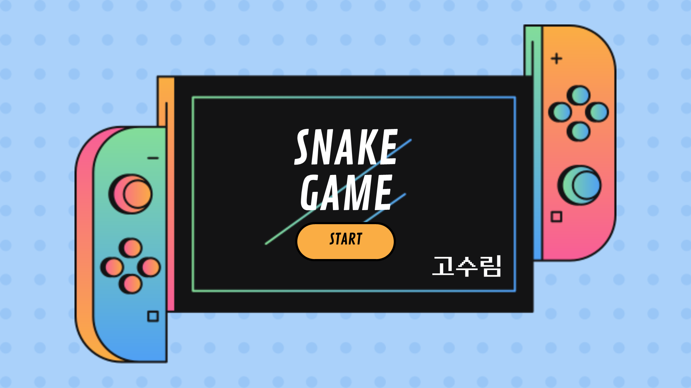
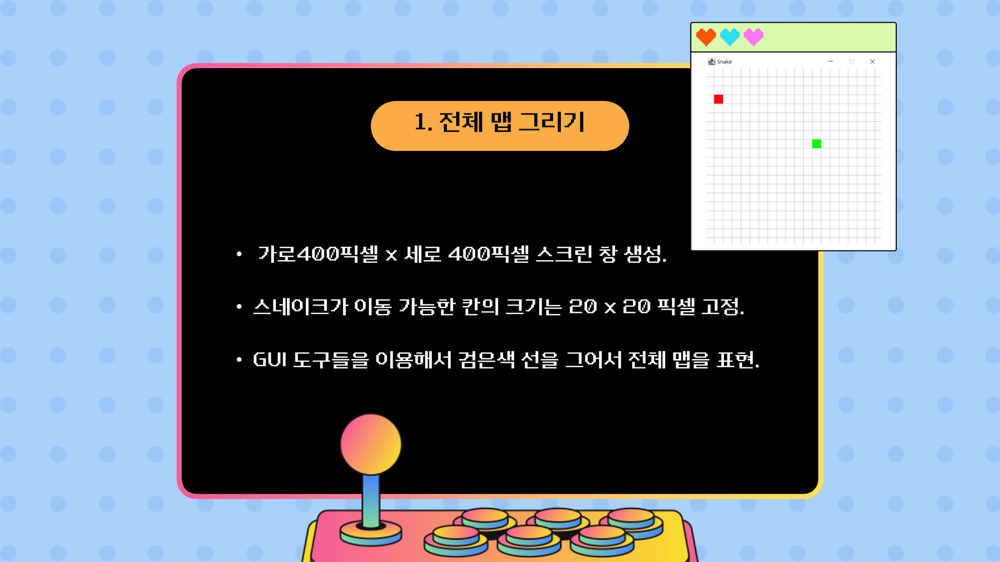
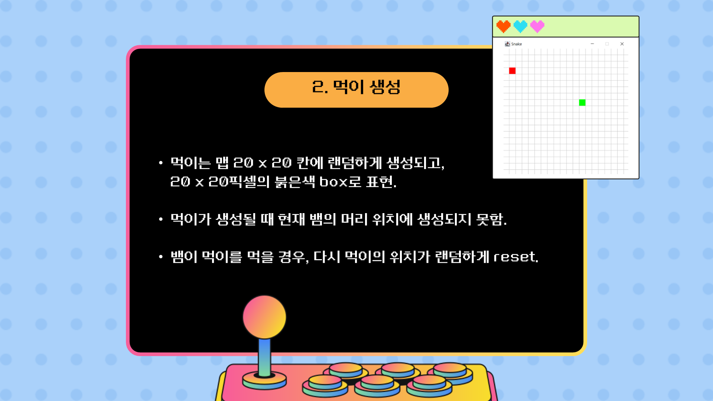
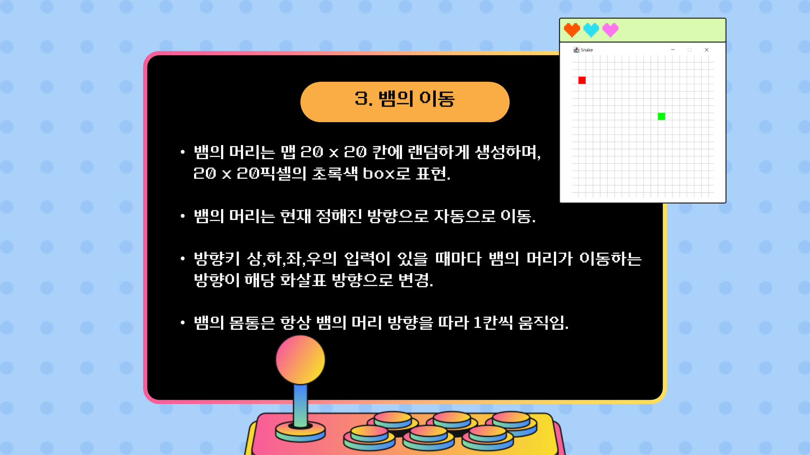
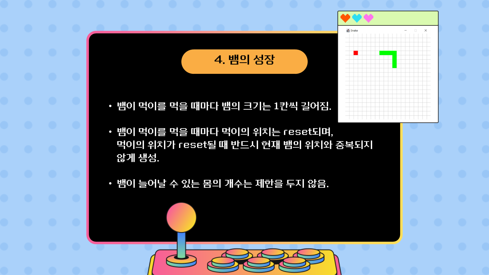
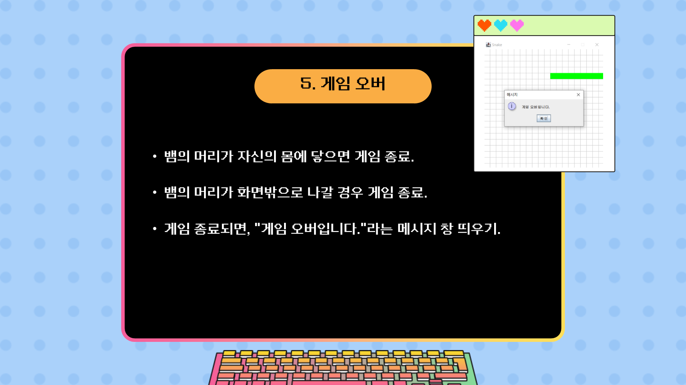
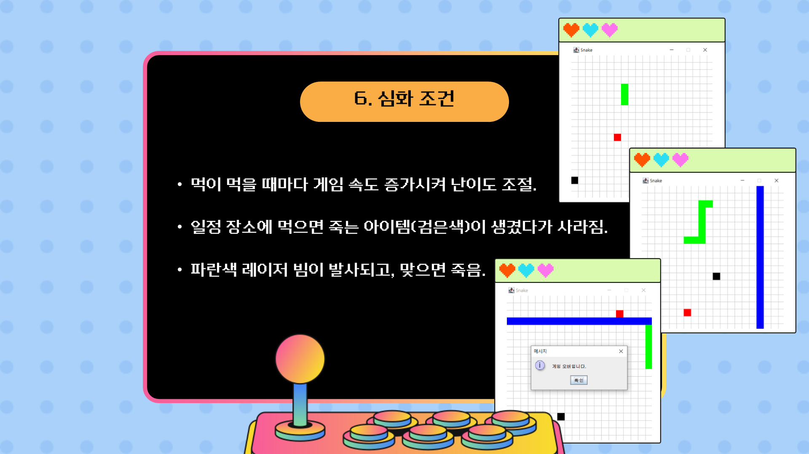

----
# 스네이크 게임 만들기

## 목차
  

## 전체 맵 그리기
  

## 먹이 생성

## 뱀의 이동

## 뱀의 성장

## 게임 오버

## 심화 조건

## 목표
* 선 그리기, 도형 채우기 등 기본적인 GUI 사용법 익히기
* 게임 제작에 대한 기본적인 감 익히기
* 물체의 충돌 체크 개념 익히기
* 뱀의 이동 알고리즘 익히기

----
